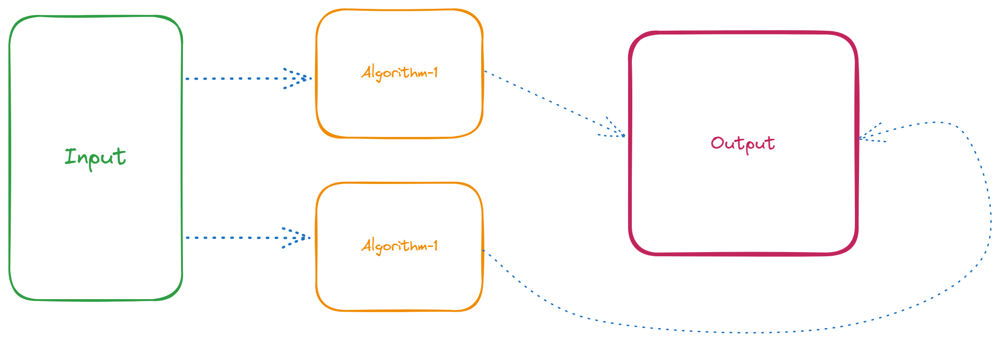

# DSA

<details>
<summary>Index</summary>

## Index
* Introduction
* Big O
* Time Complexity
* Space Complexity
* Optimization

</details>

---

<details>
<summary>Introduction</summary>

## Introduction
* __DSA__ stands for __Data Structures & Algorithms__.
* DSA decides which approach is better.
* Data Structures allow us to store and organize data efficiently, We can easily access and perform operations on the data.
* Algorithm is the process to achieve a desired result.



### Why DSA ?
* DSA makes you a better Software Engineer.
* with DSA, we can run the application with Less Memory and Less Time.


### Data Structures
1. String & Array
2. Linked List
3. Stack & Queue
4. Trees
5. Heaps
6. Graphs

### Algorithms
1. Sorting
    * Bubble
    * Selection
    * Insertion
    * Merge
    * Quick
    * Random Quick
    * Counting
    * Radix
2. Searching
    * Linear
    * Binary
    * DFS: Depth-First Search - on Graph data structure
    * BFS: Breadth-First Search - on Graph data structure


</details>

---

<details>
<summary>Big O</summary>

## Big O
Analyze the cost of an algorithm.
We can calculate the time complexity and space complexity by using __Big O__ notation.
* Space & Time complexity

</details>

---

<details>
<summary>Time Complexity</summary>

##  Time Complexity
Time Complexity is not a actual time taken by the algorithm. 
Its depending on Operating system like window, mac os...etc.

Time Complexity -> Less Time -> Decrease the Number of Operations

1. Constant Time 
2. Linear Time
3. Quadratic Time
4. Binary 
5. Sorting 
6. Recursion

### Constant Time (O(1))
Constant time complexity means that irrespective of the size of the input, the algorithm's runtime remains constant.

```js 
// 01 Arithmetic Operations -> +, -, *, /, %
const sum = 2 + 3; // O(1)

// 02 Comparison Operations ->  ==, !=, <, >, <=,  >=
const isEven = 10 % 2 === 0; // O(1)

// 03 Boolean Operations -> !, &&, ||
const isTrue = true && false; // O(1)

// 04 Accessing Properties of Objects
const person = { name: "Alice" }; 
const name = person.name; // O(1)

// 05 Accessing elements by index

// Array
const colors = ["red", "green", "blue"];
const firstColor = colors[0]; // O(1)

// String 
const message = "Hello"; 
const firstChar = message[0]; // O(1)


// 06 calculate Length

// Array
const numbers = [1, 2, 3]; 
const arrayLength = numbers.length; // O(1)

// String
     const greeting = "Welcome"; 
     const stringLength = greeting.length; // O(1)

```

### Linear Time (O(n))
Linear time complexity means that as the size of the input increases, the runtime of the algorithm grows linearly.

```js
// Array Traverse
   const numbers = [1, 2, 3, 4, 5];
   for (let i = 0; i < numbers.length; i++) {
       console.log(numbers[i]); // O(n)
   }
```

```js
// Linear Search
   const array = [4, 2, 7, 1, 9];
   const target = 7;
   for (let i = 0; i < array.length; i++) {
       if (array[i] === target) {
           console.log("Element found at index:", i);
           break;
       }
   }
   ```

### Quadratic Time (O(n^2))
Quadratic time complexity means that as the size of the input increases, the runtime of the algorithm grows quadratically.

   ```js
    // Bubble Sort
   const bubbleSort = arr => {
       const len = arr.length;
       for (let i = 0; i < len; i++) {
           for (let j = 0; j < len - 1; j++) {
                // O(n^2)
               if (arr[j] > arr[j + 1]) {
                   const temp = arr[j];
                   arr[j] = arr[j + 1];
                   arr[j + 1] = temp;
               }
           }
       }
       return arr;
   };
   ```

   ```js
    // Selection Sort
   const selectionSort = arr => {
       const len = arr.length;
       for (let i = 0; i < len - 1; i++) {
           let minIndex = i;
           for (let j = i + 1; j < len; j++) {
                // O(n^2)
               if (arr[j] < arr[minIndex]) {
                   minIndex = j;
               }
           }
           if (minIndex !== i) {
               const temp = arr[i];
               arr[i] = arr[minIndex];
               arr[minIndex] = temp;
           }
       }
       return arr;
   };
   ```


   ```js
    // Nested Loops
   const printPairs = arr => {
       for (let i = 0; i < arr.length; i++) {
           for (let j = 0; j < arr.length; j++) {
               console.log(arr[i], arr[j]);
           }
       }
   };
   ```

### Binary Search
Binary search has a time complexity of O(log n). This means that as the size of the input increases, the runtime of the algorithm grows logarithmically.


```js
// Binary Search
const binarySearch = (arr, target) => {
    let low = 0;
    let high = arr.length - 1;
    while (low <= high) {
        // O(log n)
        const mid = Math.floor((low + high) / 2);
        if (arr[mid] === target) {
            return mid;
        } else if (arr[mid] < target) {
            low = mid + 1;
        } else {
            high = mid - 1;
        }
    }
    return -1; // Element not found
};

const sortedArray = [1, 3, 5, 7, 9];
const targetElement = 5;
console.log("Index of", targetElement, ":", binarySearch(sortedArray, targetElement));
```

## O(n log n) (Sorting)
Sorting algorithms with O(n log n) time complexity are significantly faster than quadratic time sorting algorithms, especially for large datasets.

```js
// MergeSort
const mergeSort = arr => {
    if (arr.length <= 1) {
        return arr;
    }

    const middle = Math.floor(arr.length / 2);
    const left = arr.slice(0, middle);
    const right = arr.slice(middle);

    const merge = (left, right) => {
        let result = [];
        let leftIndex = 0;
        let rightIndex = 0;

        while (leftIndex < left.length && rightIndex < right.length) {
            if (left[leftIndex] < right[rightIndex]) {
                result.push(left[leftIndex]);
                leftIndex++;
            } else {
                result.push(right[rightIndex]);
                rightIndex++;
            }
        }

        return result.concat(left.slice(leftIndex)).concat(right.slice(rightIndex));
    };

    return merge(mergeSort(left), mergeSort(right));
};

const unsortedArray = [6, 2, 7, 1, 4, 9, 3, 8, 5];
console.log("Sorted Array:", mergeSort(unsortedArray));
```

### Recursion
Recursion with a time complexity of O(2^n) results in exponential growth in execution time with the input size.
```js
// Fibonacci
const fibonacci = n => {
    if (n <= 1) {
        return n;
    }
    return fibonacci(n - 1) + fibonacci(n - 2);
};

console.log("Fibonacci of 6:", fibonacci(6));
```

</details>

---

<details>
<summary>Space Complexity</summary>

## Space 
How much memory take to execute the code is called __Space__ Complexity.

Space COmplexity  : Less Memory

</details>

---

<details>
<summary>Optimization</summary>

## Optimization

Steps : 
1. First Write Code in production
2. Think About Algorithm
</details>

---
