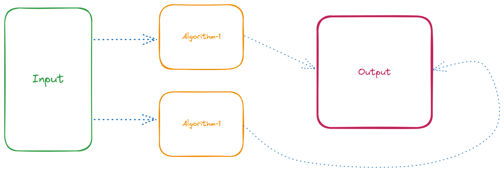
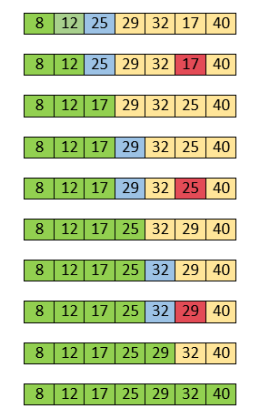

# DSA

<details>
<summary>Index</summary>

## Index

- Introduction
- Optimization
- Big O
- Time Complexity
- Space Complexity
- Arrays
- Stack
- Queue
- Linked List
- HashMap
- HashTable

</details>

---

<details>
<summary>Introduction</summary>

## Introduction

- **DSA** stands for **Data Structures & Algorithms**.
- DSA helps find the best way to solve a problem.
- Data Structures allow us to store and organize data efficiently, We can easily access and perform operations on the data.
- Algorithm is the step-by-step process used to achieve a desired result.



### Why DSA ?

- DSA makes you a better Software Engineer.
- with DSA, we can run the application with Less Memory and Less Time.

### Data Structures

1. Array
2. Stack
3. Queue
4. Linked List

### Algorithms

1. Sorting
   - Bubble
   - Selection
   - Insertion
   - Quick
2. Searching
   - Linear
   - Binary

</details>

---

<details>
<summary>Optimization</summary>

## Optimization

Steps :

1. First, write the code for production.
2. Then, think about optimizing the algorithm.

### Example

Task : Find the sum of the first n natural numbers.

#### Initial Approach

- Algorithm : **for-loop**
- Time Complexity: **O(n)**

```js
const n = 10000000;
let sum = 0;
for (let i = 1; i <= n; i++) {
  // O(n)
  sum += i;
}
console.log(sum);
```

#### Optimized Approach

- Algorithm : **Mathematical formula**
- Time Complexity: **O(1)**

```js
const n = 10000000;
let sum = (n * (n + 1)) / 2; // O(1)
console.log(sum);
```

</details>

---

<details>
<summary>Big O</summary>

## Big O

- **Big O** notation helps us understand how algorithms perform by checking their efficiency.
- We can calculate the **Time complexity** and **Space complexity** by using **Big O** notation.
- Time complexity tells us how the runtime of an algorithm changes with a larger input.
- Space complexity tells us how much memory the algorithm uses with a larger input.


</details>

---

<details>
<summary>Time Complexity</summary>

## Time Complexity

- Time complexity tells us how the runtime of an algorithm changes with a larger input.
- Its depending on Operating system like window, mac os...etc.

`Time Complexity -> Less Time -> Decrease the Number of Operations`

1. Constant Time
2. Linear Time
3. Quadratic Time
4. Logarithmic Time
5. Sorting
6. Recursion

### Constant Time **O(1)**

Constant time complexity means that the algorithm always takes the same amount of time to run, irrespective of the input size.

```js
// 01 Arithmetic Operations -> +, -, *, /, %
const sum = 2 + 3; // O(1)

// 02 Comparison Operations ->  ==, !=, <, >, <=,  >=
const isEven = 10 % 2 === 0; // O(1)

// 03 Boolean Operations -> !, &&, ||
const isTrue = true && false; // O(1)

// 04 Accessing Properties of Objects
const person = { name: "Alice" };
const name = person.name; // O(1)

// 05 Accessing elements by index

// Array
const colors = ["red", "green", "blue"];
const firstColor = colors[2]; // O(1)

// String
const message = "Hello";
const firstChar = message[2]; // O(1)

// 06 calculate Length

// Array
const numbers = [1, 2, 3];
const arrayLength = numbers.length; // O(1)

// String
const greeting = "Welcome";
const stringLength = greeting.length; // O(1)

// 07 Mathematical Formula
// sum of n natural numbers (1-100)
const n = 1000;
const sum = n(n + 1) / 2; // O(1)
```

### Linear Time **O(n)**

Linear time complexity means that as the input size increases, the algorithm's runtime also increases in a linear manner.

```js
// Array Traverse
// The loop needs to visit every element once.
const arr = [1, 2, 3, 4, 5];
let total = 0;
for (let i = 0; i < arr.length; i++) {
  // O(n)
  total += arr[i];
}
console.log(total);
```

### Quadratic Time **O(n^2)**

Quadratic time complexity means that as the input size increases, the runtime of the algorithm grows quadratically.

Quadratically : n input size

- [1] -> (1\*1) -> 1 Iterations
- [1,2] -> (2\*2) -> 4 Iterations
- [1,2,3] -> (3\*2) -> 9 Iterations

  ```js
  // Nested Loops

  const arr = [1, 2, 3, 4, 5];
  for (let i = 0; i < arr.length; i++) {
    for (let j = 0; j < arr.length; j++) {
      // O(n^2)
      console.log(arr[i], arr[j]);
    }
  }
  ```

### Logarithmic Time

Logarithmic Time means that as the input size increases, the runtime of the algorithm grows logarithmically.

- Binary search -> O(log_2 n) -> log base2 n
- Merge Sort -> O(n log n) -> n _ log n -> n _ log base2 n

logarithmically :

```shell
 log_2 1 = 0 because 2^0 = 1
 log_2 2 = 1 because 2^1 = 2
 log_2 4 = 2 because 2^2 = 4
 log_2 8 = 3 because 2^3 = 8 -> 2*2*2
```

### Recursion

it means that as the size of the input increases, the time it takes to run the function grows exponentially.

- Time Complexity : `2^n`

```js
// Factorial
function factorial(n) {
  if (n <= 1) {
    return 1;
  }
  return n * factorial(n - 1);
}

const result = factorial(5);
console.log(result);
```

</details>

---

<details>
<summary>Space Complexity</summary>

## Space

- How much memory take to execute the code is called **Space** Complexity.
- Space Complexity : Less Memory

</details>

---

<details>
<summary>Arrays</summary>

## Arrays

### Sorting

- Bubble
- Insertion
- Selection
- Quick

#### Bubble Sort

- Data Structure : Array
- Algorithm : Bubble Sort
- Time Complexity
  - Worst: **O(n^2)**
  - Average: **O(n^2)**
  - Best: **O(n)** -> when the array is already sorted

Bubble sort compares adjacent elements in a list, swapping them if they're in the wrong order, repeating until everything is sorted.

- Placing the 1st largest element at correct position.


<video src="./Assets/02-sorting/01-bubble-sort.mp4" controls></video>

```js
const arr = [2, 1, 5, 8, 4, 3, 7, 6];

for (let i = 0; i < arr.length; i++) {
  let isSorted = true;
  for (let j = 0; j < arr.length - 1; j++) {
    // O(n^2)
    if (arr[j] > arr[j + 1]) {
      isSorted = false;
      [arr[j], arr[j + 1]] = [arr[j + 1], arr[j]];
    }
  }

  if (isSorted) {
    break;
  }
}

console.log(arr); // [ 1, 2, 3, 4, 5, 6, 7, 8 ]
```

#### Insertion Sort

- Data Structure: Array
- Algorithm: Insertion Sort
- Time Complexity
  - Worst: **O(n^2)**
  - Average: **O(n^2)**
  - Best: **O(n)** -> when the array is already sorted

Insertion sort (move to backward direction) iteratively inserts each element from an unsorted list into its correct position within a sorted portion of the list.


<video src="./Assets/02-sorting/03-insertion-sort.mp4" controls></video>

```js
const arr = [2, 1, 5, 8, 4, 3, 7, 6];

for (let i = 0; i < arr.length; i++) {
  const item = arr[i];
  let j = i - 1;

  while (j >= 0 && item < arr[j]) {
    // O(n)
    arr[j + 1] = arr[j];
    console.log(arr);
    j--;
  }

  arr[j + 1] = item;
}

console.log(arr); // [ 1, 2, 3, 4, 5, 6, 7, 8 ]
```

#### Selection Sort

- Data Structure: Array
- Algorithm: Selection Sort
- Time Complexity
  - Worst: **O(n^2)**
  - Average: **O(n^2)**
  - Best: **O(n^2)**

It repeatedly selects the smallest element from the unsorted part and swaps it with the element at the beginning of the unsorted part. This process continues until the entire list is sorted. The algorithm has a time complexity of O(n^2).



<video src="./Assets/02-sorting/02-selection-sort.mp4" controls></video>

```js
const arr = [2, 1, 5, 8, 4, 3, 7, 6];

for (let i = 0; i < arr.length - 1; i++) {
  let minIndex = i;

  for (let j = i + 1; j < arr.length; j++) {
    if (arr[j] < arr[minIndex]) {
      minIndex = j;
    }
  }

  // Swap
  if (minIndex !== i) {
    [arr[i], arr[minIndex]] = [arr[minIndex], arr[i]];
  }
}

console.log(arr); // [1, 2, 3, 4, 5, 6, 7, 8]
```

#### Quick Sort

- Data Structure: Array
- Algorithm: Quick Sort
- Time Complexity
  - Worst: **O(n^2)**
  - Average: **O(n log n)**
  - Best: **O(n log n)**

Quick Sort selects a pivot, divides the array into smaller and larger elements, recursively sorts these partitions, and combines them with the pivot to obtain a sorted array.


<video src="./Assets/02-sorting/04-quick-sort.mp4" controls></video>

```js
let arr = [2, 1, 5, 8, 4, 3, 7, 6];

function quickSort(arr) {
  // Time Complexity -> n log n

  if (arr.length <= 1) {
    return arr; // Base Condition
  }

  const pivot = arr[0];

  let leftArray = []; // lesser values
  let rightArray = []; // greater values
  let equalArray = []; // equal values -> Sometimes duplicate pivot

  for (let i = 0; i < arr.length; i++) {
    if (arr[i] < pivot) {
      leftArray.push(arr[i]);
    } else if (arr[i] > pivot) {
      rightArray.push(arr[i]);
    } else {
      equalArray.push(arr[i]);
    }
  }

  const result = [
    ...quickSort(leftArray),
    ...equalArray,
    ...quickSort(rightArray),
  ];
  return result;
}

const output = quickSort(arr);

console.log("Sorted array:", output);
```

### Searching

- Linear Search
- Binary Search

#### Linear Search

- Data Structure: Array
- Algorithm: Linear Search
- Time Complexity
  - Worst : **O(n)**
  - Average : **O(n)**
  - Best: \_\_O(1) -> when the target element is found at the beginning of the array.

Linear search checks each element in a list one by one for the target value, returning its index if found or "Not Found" otherwise.

```js
const arr = [2, 1, 5, 8, 4, 3, 7, 6];
const target = 3;

let output = null;
for (let i = 0; i < arr.length; i++) {
  // O(n)
  if (arr[i] === target) {
    output = i;
    break;
  }
}

console.log("Element found at index: " + output); // Element found at index: 5
```

#### Binary Search

- Data Structure: Array
- Algorithm: Binary Search
- Time Complexity :
  - Worst : **O(log n)**
  - Average : **O(log n)**
  - Best : **O(1)** -> when the target element is found at the middle of the array.

Binary search quickly finds a target value in a sorted array by repeatedly dividing the search range in half and checking the middle element, reducing the search area each time.

```js
const arr = [1, 2, 3, 4, 5, 6, 7, 8]; // Sorted Array
let target = 7; // Target Element

let startIndex = 0;
let endIndex = arr.length - 1;
let midIndex;
let found = false;

while (startIndex <= endIndex) {
  // O(log_2 n)
  midIndex = Math.floor((startIndex + endIndex) / 2); // takes minimum nearest integer

  if (arr[midIndex] == target) {
    found = true;
    break;
  } else if (arr[midIndex] < target) {
    startIndex = midIndex + 1;
  } else {
    endIndex = midIndex - 1;
  }
}

if (found) {
  console.log("Element found at index: " + midIndex); // Element found at index: 6
} else {
  console.log("Element Not Found");
}
```

</details>

---

<details>
<summary>Stack</summary>

## Stack

A stack is a linear data structure that follows the First-In-Last-Out (FILO) principle.

- FILO : First In Last Out


### Example

- Pushing an element onto the stack is like adding a new plate on top.
- Popping an element removes the top plate from the stack.

### Operations

- push: Adds an element to the top of the stack.
- peek: Returns the top element without removing it.
- pop: Removes the top element from the stack.

```js
// Stack

/*
Data Structure : Stack -> FILO

Methods:
    * push() -> Add an item to the top of the stack
    * display() 
    * size()
    * isEmpty()
    * peek() -> Peeks at the top item of the stack without removing it
    * pop() -> Removes at the top item of the stack
*/

class Stack {
  constructor() {
    this.items = [];
  }

  push(item) {
    this.display().push(item);
  }

  display() {
    return this.items;
  }

  size() {
    return this.display().length;
  }

  isEmpty() {
    return this.size() === 0;
  }

  peek() {
    // Return the top item without removing it
    if (this.isEmpty()) {
      return null;
    } else {
      const topItem = this.display()[this.size() - 1];
      return topItem;
    }
  }

  pop() {
    if (this.isEmpty()) {
      return null;
    } else {
      let poppedItem = this.display().pop();
      return poppedItem;
    }
  }
}

// Instance
const stack = new Stack();
console.log(stack);

stack.push("data1");
console.log(stack.display());

stack.push("data2");
stack.push("data3");
stack.push("data4");

console.log(stack.display());

console.log(stack.isEmpty());

console.log(stack.size());

console.log(stack.peek());

console.log(stack.pop());

console.log(stack.size());

console.log(stack.display());
```

</details>

---

<details>
 <summary>Queue</summary>

## Queue

A Queue is a linear data structure that follows the First-In-First-Out (FIFO) principle.

- FIFO : First In First Out
  
  

### Methods

- enqueue (Insert): Adds an element to the rear of the queue.
- Peek: Returns the element at the front of the queue without removing it.
- dequeue (Delete): Removes and returns the element from the front of the queue.

```js
// Queue

/*
Data Structure : Queue -> FIFO

Methods :
    * enqueue() -> Add an item to the top of the queue
    * display()
    * size()
    * isEmpty()
    * peek() -> Peeks at the first item of the queue without removing it
    * dequeue() -> Removes at the first element of the queue
*/

class Queue {
  constructor() {
    this.items = [];
  }

  enqueue(item) {
    this.display().push(item);
  }

  display() {
    return this.items;
  }

  size() {
    return this.display().length;
  }

  isEmpty() {
    return this.size() === 0;
  }

  peek() {
    if (this.isEmpty()) {
      return null;
    } else {
      const firstItem = this.display()[0];
      return firstItem;
    }
  }

  dequeue() {
    if (this.isEmpty()) {
      return null;
    } else {
      const shiftedItem = this.display().shift();
      return shiftedItem;
    }
  }
}

// Instance
const queue = new Queue();
console.log(queue);

queue.enqueue("data1");
console.log(queue);

console.log(queue.display());

queue.enqueue("data2");
queue.enqueue("data3");
queue.enqueue("data4");

console.log(queue.display());
console.log(queue.peek());

console.log(queue.size());
console.log(queue.dequeue());

console.log(queue.display());

console.log(queue.dequeue());

console.log(queue.display());
```

</details>

---

<details>
<summary>LinkedList</summary>

## LinkedList

A **linkedList** is a linear data structure which can store a collection of "nodes" connected together via links.

- Every node consists of the data and next (address of the next node).
- we no need to assign a memory in advance.
- Dynamic memory allocation


### Disadvantages

Access Time: Elements must be accessed sequentially, making random access time linear O(n).

### Types of LinkedLists

- Singly LinkedList: Each node points to the next node in the sequence.
- Doubly LinkedList: Each node has two references, one to the next node and one to the previous node. we can traverse in in both forward and backward directions.
- Circular LinkedList: The last node points back to the first node, forming a circle.

#### Singly LinkedList

In a singly linked list, each node typically has two components

- Data: The value stored in the node.
- Next: A reference to the next node in the list.

```js
// LinkedList

/*
Data Structure : LinkedList -> Create linked Nodes

Every Node Contains data & next (reference link for next node)
*/

// Node Template
class Node {
  constructor(data) {
    this.data = data;
    this.next = null;
  }
}

// create node instances
const node1 = new Node("data1");
console.log(node1);

const node2 = new Node("data2");
console.log(node2);

const node3 = new Node("data3");
console.log(node3);

console.log("--------------");

/* ------> LinkedList <----- */
// connect the nodes
const head = node1; // The head is where we start
node1.next = node2;
node2.next = node3;

console.log(head);

console.log("--------------");

/* -----> Traverse on Each Node <----- */
let current = head;
while (current) {
  // current !==null
  console.log(current.data);
  current = current.next;
}

console.log("==========");
```

</details>

---

<details>
<summary>HashMap</summary>

## HashMap

A **HashMap** in JavaScript is a data structure that implements a collection of key-value pairs, allowing efficient insertion, deletion, and lookup operations.

- Key-Value Storage: Each element in a Map is stored as a key-value pair.
- Any Type of Keys: Unlike regular objects, keys in a Map can be of any type, including objects, functions, and primitive types.
- Ordered Entries: The insertion order of keys is preserved in a Map.
- Size Property: A Map has a size property that returns the number of key-value pairs in it.
- Efficient Operations: Provides efficient methods for operations like getting, setting, and checking the existence of elements.

### Comparing with Objects

- Objects can only have strings and symbols as keys, while Map can have keys of any type.
- The order of keys in Objects is not guaranteed, whereas Map maintains the insertion order.
- Map has a built-in size property, while for Objects, you need to manually track the size or use Object.keys(obj).length.

### creating Map

```js
// HashMap
/*
data STructure : Map

Methods :
    * set()
    * has()
    * get()
    * size()
    * delete()
    * keys()
    * values()
    * entries()
    * clear()
*/

// Create HashMap
const mymap = new Map();
console.log(mymap);

// Add Elements
mymap.set("key", "value");
mymap.set(2, "I am Number");

let arrayKey = [1, 2, 3];
mymap.set(arrayKey, "I am Array");

let objectKey = { a: 1, b: 2, c: 3 };
mymap.set(objectKey, "I am Object");

console.log(mymap);

console.log("---------");

// Checking Existance
console.log(mymap.has("key")); // true

console.log("---------");

// Accessing Elements
console.log(mymap.get("key"));
console.log(mymap.get(2));
console.log(mymap.get(arrayKey));
console.log(mymap.get(objectKey));

console.log("------------");

// Checking Size
console.log(mymap.size);

// delete Elements
mymap.delete("key");
console.log(mymap);

console.log(mymap.size);

console.log("-------------");

// Iterating using for-loop
for (let [key, value] of mymap) {
  console.log(key, value);
}

console.log("----------");

// Iterating using forEach
mymap.forEach((value, key) => {
  console.log(key, value);
});

console.log("--------------");

console.log(mymap.keys());
console.log(mymap.values());
console.log(mymap.entries());

console.log("----------");

// Clear All Elements
mymap.clear();

console.log(mymap);

console.log("===========");
```

</details>

---

<details>
<summary>HashTable</summary>

## HashTable

A HashTable is a data structure that stores key-value pairs and retrieve a key-value pairs very quickly. It's like a special kind of dictionary.

- It is designed to provide fast insertion, deletion, and retrieval of elements based on their keys.
- A hash table is a data structure that organizes data using a technique called hashing.
- It stores key-value pairs, where each key is unique. When we want to store or retrieve a value, we use a hash function to convert the key into an index in an array.
- This allows us to quickly locate the value associated with a given key without needing to search through the entire collection.

</details>

---
