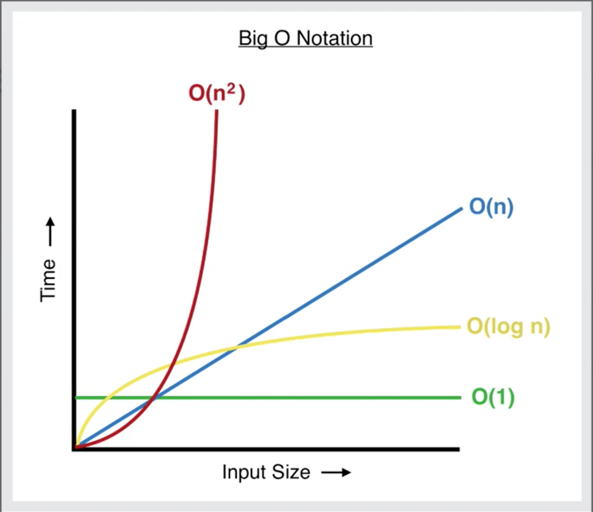

# DSA

<details>
<summary>Index</summary>

## Index
* Introduction
* Optimization
* Big O
* Time Complexity
* Space Complexity
* Sorting
* Searching
</details>

---

<details>
<summary>Introduction</summary>

## Introduction
* __DSA__ stands for __Data Structures & Algorithms__.
* DSA helps find the best way to solve a problem.
* Data Structures allow us to store and organize data efficiently, We can easily access and perform operations on the data.
* Algorithms are the step-by-step processes used to achieve a desired result.


### Why DSA ?
* DSA makes you a better Software Engineer.
* with DSA, we can run the application with Less Memory and Less Time.

### Data Structures
1. String & Array
2. Linked List
3. Stack & Queue
4. Trees
5. Heaps
6. Graphs

### Algorithms
1. Sorting
    * Bubble
    * Selection
    * Insertion
    * Quick
2. Searching
    * Linear
    * Binary

</details>

---

<details>
<summary>Optimization</summary>

## Optimization

Steps : 
1. First, write the code for production.
2. Then, think about optimizing the algorithm.

### Example
Task : Find the sum of the first n natural numbers.

### Initial Approach
* Algorithm : __for-loop__
* Time Complexity: __O(n)__

```js
    const n = 100000000000
    let sum = 0;
    for (let i=1; i<=n; i++) {
        // O(n)
        sum += i;
    }
    console.log(sum)
```

### Optimized Approach
* Algorithm : __Mathematical formula__
* Time Complexity: __O(1)__

```js
    const n = 100000000000
    let sum = n * (n+1)/2  // O(1)
    console.log(sum)
```

</details>

---

<details>
<summary>Big O</summary>

## Big O
* __Big O__ notation helps us understand how algorithms perform by checking their efficiency.
* We can calculate the __Time complexity__ and __Space complexity__ by using __Big O__ notation.
* Time complexity tells us how the runtime of an algorithm changes with a larger input.
* Space complexity tells us how much memory the algorithm uses with a larger input.


</details>

---

<details>
<summary>Time Complexity</summary>

##  Time Complexity
* Time complexity tells us how the runtime of an algorithm changes with a larger input.
* Its depending on Operating system like window, mac os...etc.

`Time Complexity -> Less Time -> Decrease the Number of Operations`

1. Constant Time 
2. Linear Time
3. Quadratic Time
4. Logarithmic Time
5. Sorting 
6. Recursion

### Constant Time __O(1)__
Constant time complexity means that the algorithm always takes the same amount of time to run, irrespective of the input size.

```js 
// 01 Arithmetic Operations -> +, -, *, /, %
const sum = 2 + 3; // O(1)

// 02 Comparison Operations ->  ==, !=, <, >, <=,  >=
const isEven = 10 % 2 === 0; // O(1)

// 03 Boolean Operations -> !, &&, ||
const isTrue = true && false; // O(1)

// 04 Accessing Properties of Objects
const person = { name: "Alice" }; 
const name = person.name; // O(1)

// 05 Accessing elements by index

// Array
const colors = ["red", "green", "blue"];
const firstColor = colors[2]; // O(1)

// String 
const message = "Hello"; 
const firstChar = message[2]; // O(1)


// 06 calculate Length

// Array
const numbers = [1, 2, 3]; 
const arrayLength = numbers.length; // O(1)

// String
     const greeting = "Welcome"; 
     const stringLength = greeting.length; // O(1)

// 07 Mathematical Formula
// sum of n natural numbers (1-100)
const n = 1000;
const sum = n(n+1)/2 // O(1)
```

### Linear Time __O(n)__
Linear time complexity means that as the input size increases, the algorithm's runtime also increases in a linear manner.

```js
// Array Traverse
   const arr = [1, 2, 3, 4, 5];
   for (let i=0; i<arr.length; i++) {
        // O(n)
       console.log(arr[i]); 
   }
```

### Quadratic Time __O(n^2)__
Quadratic time complexity means that as the input size increases, the runtime of the algorithm grows quadratically.

Quadratically : n input size
* [1] -> (1*1)  -> 1 Iterations
* [1,2] -> (2*2) -> 4 Iterations
* [1,2,3] -> (3*3) -> 9 Iterations

   ```js
    // Nested Loops
    const arr = [1,2,3];

    for (let i=0; i<arr.length; i++) {
           for (let j=0; j<arr.length; j++) {
            // O(n^2)
               console.log(arr[i], arr[j]);
           }
       }

   ```

### Logarithmic Time
Logarithmic Time means that as the input size increases, the runtime of the algorithm grows logarithmically.
* Binary search ->  O(log_2 n) -> log base2 n 
* Merge Sort -> O(n log n) -> n * log n -> n * log base2 n

logarithmically : 

```shell
 log_2 1 = 0 because 2^0 = 1
 log_2 2 = 1 because 2^1 = 2
 log_2 4 = 2 because 2^2 = 4
 log_2 8 = 3 because 2^3 = 8 -> 2*2*2
```

### Recursion
 it means that as the size of the input increases, the time it takes to run the function grows exponentially.
* Time Complexity : 2^n 

```js
// Factorial
function factorial(n) {
    if (n <= 1) {
        return 1;
    }
    return n * factorial(n - 1);
};

const result = factorial(5);
console.log(result);
```

</details>

---

<details>
<summary>Space Complexity</summary>

## Space 
* How much memory take to execute the code is called __Space__ Complexity.
* Space COmplexity  : Less Memory

</details>

---

<details>
<summary>Sorting</summary>

## Sorting
* Bubble
* Selection
* Insertion
* Merge
* Quick
* Random Quick
* Counting
* Radix

### Bubble Sort
* Data Structure : Array
* Algorithm : Bubble Sort
* Time Complexity
    - Worst: O(n^2)
    - Average: O(n^2)
    - Best: O(n) -> when the array is already sorted

Bubble sort compares adjacent elements in a list, swapping them if they're in the wrong order, repeating until everything is sorted.

<video src="./Assets/02-sorting/01-bubble-sort.mp4" controls></video>

```js 
unordered array

for loop to run length of array:
    for loop to run length of array:
       // O(n^2)
        if current element > next element:
            Swap their positions

print the output
```

### Selection Sort
* Data Structure: Array
* Algorithm: Selection Sort
* Time Complexity
    - Worst: O(n^2)
    - Average: O(n^2)
    - Best: O(n^2)

 It repeatedly selects the smallest element from the unsorted part and swaps it with the element at the beginning of the unsorted part. This process continues until the entire list is sorted. The algorithm has a time complexity of O(n^2).

<video src="./Assets/02-sorting/02-selection-sort.mp4" controls></video>

```js
Unordered array

for loop to run length of array:
    take small_number_index from parent for loop
    for loop to run length of array:
        // O(n^2)
        if parent loop number is greater than child loop number:
            update small_number_index to child loop number index
    Swap their positions

print the output
```

### Insertion Sort
* Data Structure: Array
* Algorithm: Insertion Sort
* Time Complexity
    - Worst: O(n^2)
    - Average: O(n^2)
    - Best: O(n) -> when the array is already sorted

Insertion sort iteratively inserts each element from an unsorted list into its correct position within a sorted portion of the list. 

<video src="./Assets/02-sorting/03-insertion-sort.mp4" controls></video>

```js
Unordered array

for loop to run length of array:
    save the current element as small_number
    for loop to run backwards length of the array:
        // O(n^2)
        if small_number < current element in the sorted portion:
            move the current element one position to the left
        else:
        break the loop

print the output
```

### Quick Sort
* Data Structure: Array
* Algorithm: Quick Sort
* Time Complexity
    - Worst: O(n^2)
    - Average: O(n log n)
    - Best: O(n log n) 

Quick Sort selects a pivot, divides the array into smaller and larger elements, recursively sorts these partitions, and combines them with the pivot to obtain a sorted array.

<video src="./Assets/02-sorting/04-quick-sort.mp4" controls></video>

```js
Unordered array

recursive function with arr as parameter:
  if arr length <= 1:
        return arr

  Choose a pivot element from the array (typically the first element)

  leftArray
  rigghtArray
  eaquaArray

  for loop to run length of array:
    - values less than the pivot are placed to the leftArray
    - values greater than the pivot are placed to the rightArray
    - values equal to the pivot are placed to the equalArray

  Recursively apply Quick Sort to the left and right subarrays

  Combine the sorted subarrays to form the final sorted array

call the quickSort with arr as parameter
print the output
```
</details>

---

<details>
<summary>Searching</summary>

## Searching
* Linear 
* Binary

### Linear
* Data Structure: Array
* Algorithm: Linear Search
* Time Complexity
    - Worst : O(n)
    - Average : O(n)
    - Best: O(1) -> when the target element is found at the beginning of the array.

Linear search checks each element in a list one by one for the target value, returning its index if found or "Not Found" otherwise. 

```js 
Unordered array
target value

for loop to run length of array:
    if found the target value:
        print the output
        break the loop
```

### Binary
* Data Structure: Array
* Algorithm: Binary Search
* Time Complexity : 
    - Worst : O(log n)
    - Average : O(log n)
    - Best : O(1) when the target element is found at the middle of the array.

Binary search quickly finds a target value in a sorted array by repeatedly dividing the search range in half and checking the middle element, reducing the search area each time. This method is much faster than linear search.


```js
ordered array
target value

leftIndex
rightIndex
midIndex

while to run upto midValue equals to target:
    if target equal to midValue:
        print the output
        break the loop
    
    if target is lower than midValue:
        update rightIndex to midIndex
    else target is greater than midValue: 
        update leftIndex to midIndex   

    update midIndex
```
</details>

---